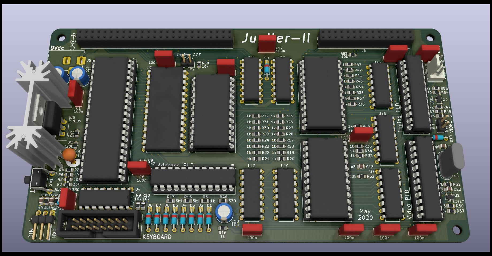

# Jupiter-II
Another Jupiter Ace computer clone.

Main differences from the original Jupiter Ace:
* Buffered composite video output
* Reset button
* Inverted video selection
* Paged screen and character set RAMs (selection at video expansion connector)
* Speaker/Mic outputs modified to match modern audio equipment
* PLDs replacing several TTL logic
* Pin headers expansion connectors instead of board edge connector

Tools used & file formats:
* Designed with [Kicad](https://www.kicad-pcb.org/)
* Programmable Logic Devices coded in CUPL language (compiled with WinCupl available for free at [Microchip](https://www.microchip.com/))

For more information on Jupiter Ace visit [The Jupiter Ace Archive](http://jupiter-ace.co.uk/)
